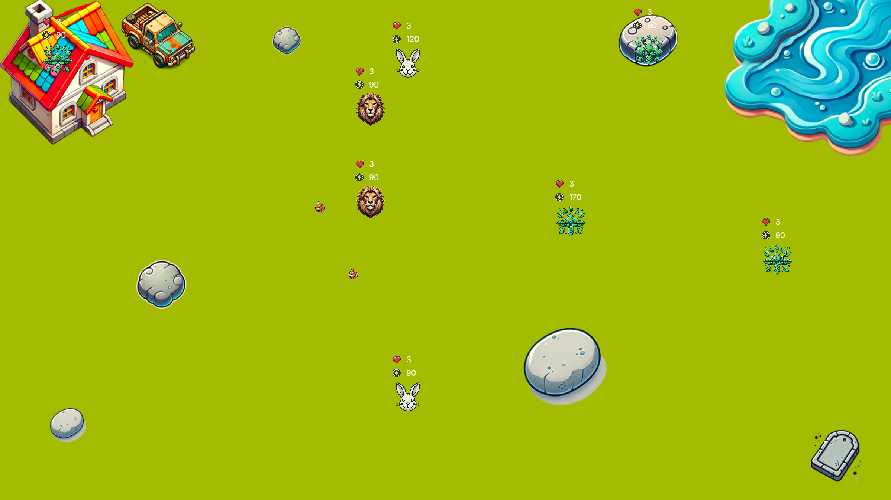
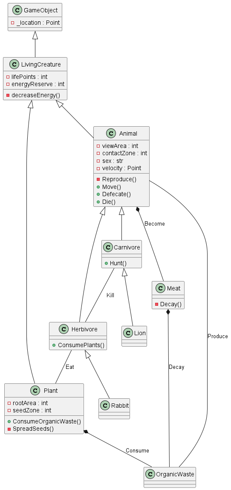
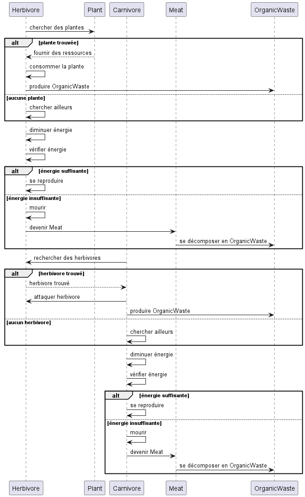
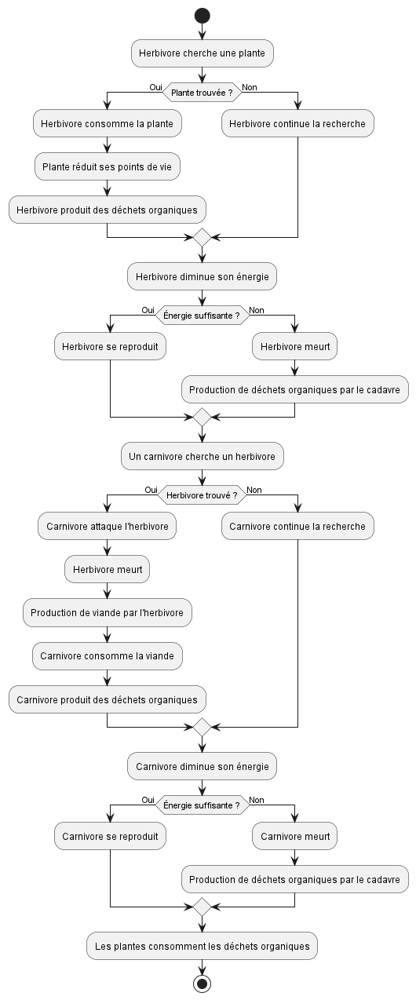

# Ecosystem project 
Auteur : **Nomena R**
## Description
Ce projet vise à simuler le comportement de différentes créatures vivantes dans un écosystème, y compris les animaux et les plantes. Leurs comportements naturels, tels que la reproduction, l'alimentation et la chasse, sont simulés de manière autonome dans cette application. Différentes entités sont simulées et ont chacune des caractères différentes : animaux carnivores, animaux herbivores, plantes.

## Diagrammes UML
### Diagramme de classes

### Diagramme de séquence

### Diagramme d'activité

## Principe SOLID
### Single Responsibility Principle
> Les classes et les méthodes ne doivent être responsables que d'une chose.
Chaque classe du diagramme a une responsabilité unique et bien définie :
- Animal : Responsable des comportements généraux des animaux (mouvement, reproduction, mort, etc.).
- Plant : Responsable des comportements spécifiques aux plantes (consommation de déchets organiques, dispersion des graines).
- Carnivore / Herbivore : Héritent d’Animal et ajoutent des comportements spécifiques, comme la chasse pour les carnivores et la consommation de plantes pour les herbivores.
- OrganicWaste : Représente les déchets organiques, sans autre responsabilité.
- Meat : Représente la viande produite par les carnivores après une chasse.

### Open/closed Principle
> Les entités logicielles (classes, modules, fonctions, etc.) doivent être ouvertes à l'extension mais fermées à la modification.
Il est possible d'ajouter de nouvelles fonctionnalités à votre projet sans modifier le code existant, afin de minimiser les risques de bugs et de maintenir une grande stabilité.
- **Structure des classes et héritages**
Le projet utilise une hiérarchie d’héritage claire, où des classes parent (comme LivingCreature et Animal) définissent des comportements communs, tandis que des sous-classes spécialisées (comme Carnivore, Herbivore, Plant) permettent l’extension des comportements.
- **Utilisation du polymorphisme**
Les interactions dans le projet, comme la chasse (Hunt()) ou la consommation de plantes (ConsumePlants()), semblent être définies de manière générique. Par exemple :

    - Un carnivore peut appeler Hunt() pour tuer un herbivore, indépendamment du type exact d’herbivore.
    - Un herbivore peut appeler ConsumePlants() pour consommer une plante, indépendamment du type de plante.